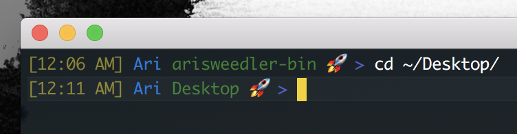
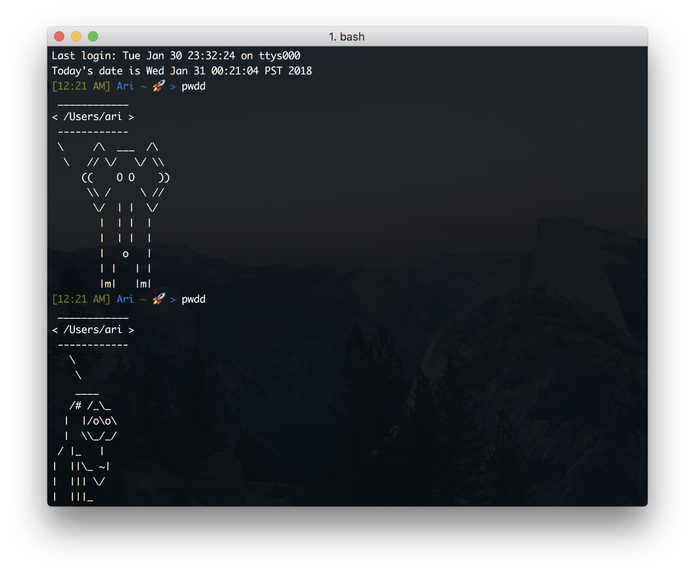

# Hi! Welcome to my bin.
### (And my dotfiles)

This is where I keep all my executables. Right now, it's just a bunch of shell scripts. I save them in my bin, because my bin's in my path. And that's a good thing because it lets me take advantage of bash's autocompletion feature! Aliasing could actually accomplish the cowsay-pwd function, or the mounting/unmounting of the lnxsrv, but I like typing mt-<tab> and unm<tab> WAY more than the full sentence.

## PS1-custom

Here's a script that'll help you create a custom-made PS1. You can have a fun PS1 in 2 steps!

1. Customize what you want your PS1 to look like

2. [Source](https://stackoverflow.com/questions/45761508/whats-the-difference-between-script-or-source-script-bash-script) the shell script in your .profile file (or .bashrc or .bash_profile)

Boom! Just like that, you have a neat and fancy PS1. You can check out what mine looks like:

 
I tried to make the script easy to use, *the only stuff that you'll need to modify is near the bottom*, under the sections labeled "Set the colors" and "Assemble". You can customize your PS1 by changing the calls to STYLE.
 
To customize your PS1, you'll make heavy use of my STYLE function in the "set the colors and parts" section. Each time you call the STYLE function, it'll initialize a shell variable containing the string you passed it preceeded by the escape code for the style you decide to give it (light RED, bold YELLOW, etc.). Make sure you pay attention to casing when naming styles!!

Then, once you've initialized and styled all your chunks of your PS1, you can put them together however you want in the "assemble" section, and you'll have your finished product!

Check out the following links for more details: 1. More about escape codes for [colors](http://tldp.org/HOWTO/Bash-Prompt-HOWTO/x329.html) in bash 2. Check out the [bash man page](https://linux.die.net/man/1/bash), the section titled "Prompting"

## cowsay-pwd

lmaoooooo

Or should I say lmoooooooooooo

I have the cowsay application stuck in my bin, and I placed `alias pwdd='. cowsay-pwd'` in my .bash_rc file, so I can laugh at how stupid I am whenever I want. A short explanation of the script:

1. You should know what `cowsay -f <animal> <text>` does. If not, read about cowsay [here](https://askubuntu.com/questions/527501/what-cowsay-characters-does-ubuntu-have-by-default-and-how-can-i-test-them). I learned about cowsay from this article: [cool terminal command](http://smashingtips.com/linux/cool-terminal-commands-for-linux).

2. `cowsay -l` lists all the possible animals 3. `tr -s ' ' '\n'` reformats the output such that there's one animal per line

4. `tail -5 | head -1` cuts off all but the last 5 lines, then all but the first line. This effectively selects text only on the 5th to last line. I could also accomplish this with a handsome text editor like [sed](https://stackoverflow.com/questions/6022384/bash-tool-to-get-nth-line-from-a-file) or awk, but I kinda like how beautifully simple and sloppy it is. It makes me smile n laugh, and I'm actually pretty proud of how easy this was for me, `jot` was the only thing I had to look up, so I'm keeping it.

5. `jot -r 1 1 50` Gives me one random number between 1 and 50 inclusive. I just wanted a simple and easy RNG bash tool. This is the driving force behind this whole tool! More info on how to get [random numbers in a shell](https://stackoverflow.com/questions/2556190/random-number-from-a-range-in-a-bash-script)

6. Now that we've taken a random line from our list of animals, we'll just invoke `cowsay -f $ANIMAL $TEXT`, where text is our pwd, to put a nice lil skin over the regular pwd function. Neat! Fun fact, I called this with $PWD instead of \`pwd\` because \`pwd\` in a shell script will return the pwd of the script, NOT the user's pwd. If I had aliased this, then \`pwd\` would have worked.

You can see what it looks like on my
[twitter](https://twitter.com/Adsweed/status/954638087660777475). Or here:

## cowsay-fortune

This idea is funny

## myMount / unmount-myMount

I have these coubled with the following aliases:

    alias mount-beaglebone='myMount bb /root'
    alias mt-lnxsrv='myMount ucla /u/cs/ugrad/ari/Classes/'

I love these scripts, because they make mounting my remote folders so easy!! I've implemented checks to see if I'm connected before trying to mount because sshfs doesn't fail very well, it's not that robust.

## connected <server>

Ping the server represented by argument once. Only wait for 100ms to recieved a response. Pipe all stderr to stdout, and pipe all stdout to THE VOID

## Dotfiles
Read about those [here](https://github.com/AriSweedler/arisweedler-bin/tree/master/dotfiles)

